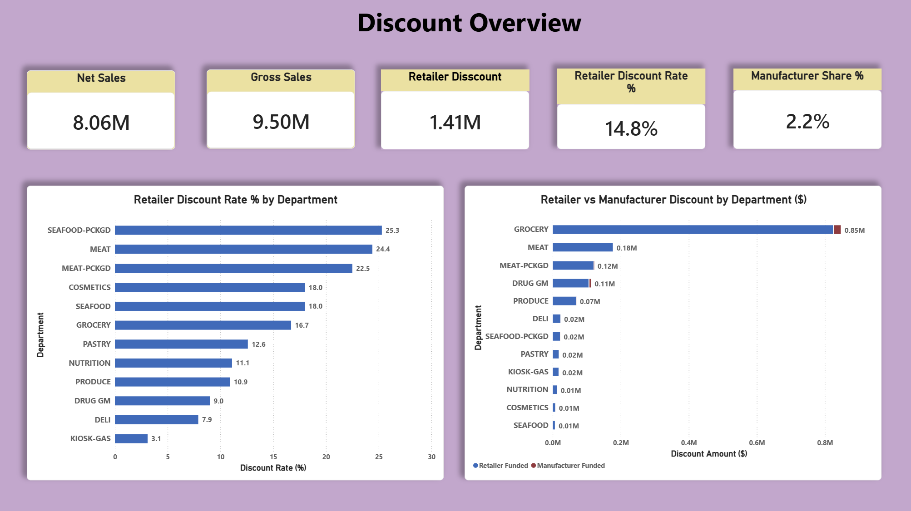
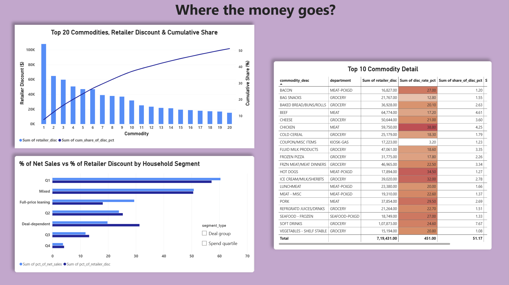
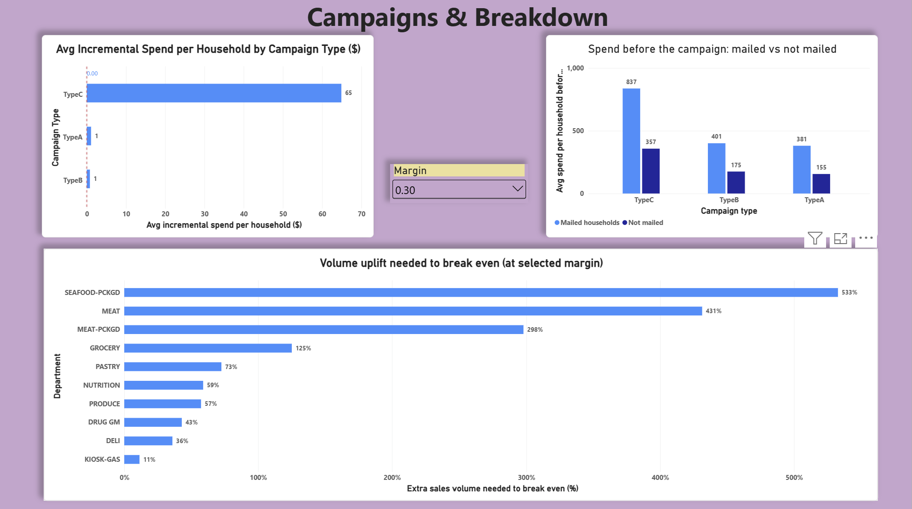

<p align="center">
  
</p>

<h1 align="center">Discount Leakage Analysis</h1>

<p align="center">
  <em>Where does a grocery retailer's $1.4 million discount budget actually go?</em><br/>
  <em>A end-to-end data analysis project using Python, MySQL and Power BI.</em>
</p>

<p align="center">
  
  
  
  
  
</p>

---

## 📚 Table of Contents

- [🎯 Problem Statement](#-problem-statement)
- [📊 Dashboard](#-dashboard)
- [🔍 Key Findings](#-key-findings)
- [💡 Recommendations](#-recommendations)
- [🗂 Project Structure](#-project-structure)
- [⚙️ How to Run](#%EF%B8%8F-how-to-reproduce)
- [⚠️ Limitations](#%EF%B8%8F-limitations)
- [📁 Dataset](#-dataset)

---

## 🎯 Problem Statement

A grocery retailer spends **$1,405,913 per year** on loyalty discounts, coupons and direct-mail campaigns — but has no visibility into:

| Question | Business Impact |
|---|---|
| Which departments and commodities absorb the most discount dollars? | Identifies where discount spend is concentrated |
| Are discounts proportional to sales, or is there a leakage gap? | Flags commodities with discount share far above their sales share |
| Do discounts go to loyal customers or deal-seekers? | Tests whether discount spend drives loyalty or just price sensitivity |
| Do mailed campaigns generate incremental spend? | Determines whether campaign budget is returning value |
| What volume uplift is needed to break even on each department's discounts? | Sets a data-driven threshold for future promotion approvals |

**Scale:** 2,581,266 transactions · 2,500 loyalty households · 29 campaigns · 92,353 products

---

## 📊 Dashboard

### Page 1 — Discount Overview
> Cards for total spend, discount rate and manufacturer share; discount rate by department; retailer vs manufacturer funding by department.



---

### Page 2 — Where the Money Goes
> Pareto chart of top 20 commodities by discount dollars; commodity detail table with conditional formatting; household segment comparison.



---

### Page 3 — Campaigns & Break-even
> Campaign lift by type (all negative); pre-campaign spend comparison showing selection bias; interactive break-even table with margin slider.



---

## 🔍 Key Findings

### 1. 💰 GROCERY absorbs 58.6% of all retailer discount dollars

| Department | Retailer Disc ($) | Disc Rate | % of All Disc |
|---|---|---|---|
| GROCERY | 823,931 | 16.7% | 58.6% |
| MEAT | 176,700 | 24.4% | 12.6% |
| MEAT-PCKGD | 119,792 | 22.5% | 8.5% |
| DRUG GM | 105,321 | 9.0% | 7.5% |
| PRODUCE | 68,501 | 10.9% | 4.9% |

Manufacturer-funded discounts are negligible at **$32,283 (2.2%)** of total discount spend. The retailer funds **97.8%** of all discounts.

---

### 2. 📦 Top commodities show clear discount leakage

The top 20 commodities account for **51.2%** of all retailer discount dollars. Key leakage cases:

| Rank | Commodity | Disc Share | Sales Share | Gap |
|---|---|---|---|---|
| 1 | SOFT DRINKS | 7.67% | 4.62% | +3.05 pp |
| 3 | CHICKEN | 4.25% | 1.62% | **+2.63 pp** |
| 4 | CHEESE | 3.60% | 2.53% | +1.07 pp |
| 17 | HOT DOGS | 1.27% | 0.55% | +0.72 pp |

**CHICKEN** is the worst case: takes 4.25% of discount dollars for only 1.62% of gross sales — **2.6× overweighted**.

---

### 3. 👥 Deal-dependent households capture disproportionate discounts

| Segment | Households | % of Net Sales | % of Retailer Disc | Disc Rate |
|---|---|---|---|---|
| Q1 — Top spenders | 625 | 60.4% | 57.2% | 14.1% |
| Deal-dependent | 625 | **19.8%** | **31.3%** | **21.5%** |
| Full-price leaning | 625 | 29.4% | 18.1% | 9.7% |

Deal-dependent households generate **19.8% of net sales** but take **31.3% of retailer discounts** — at more than double the discount rate of full-price customers.

---

### 4. 📬 No campaign type shows positive average lift

| Campaign Type | Campaigns | Avg Lift ($/HH) | Mailed Pre-spend | Control Pre-spend |
|---|---|---|---|---|
| TypeA | 5 | **-$1.10** | $380.58 | $155.50 |
| TypeB | 18 | **-$0.80** | $400.57 | $175.03 |
| TypeC | 6 | **-$64.91** | $836.95 | $357.35 |

All 3 campaign types show negative lift. Mailed households also spent **2.2–2.4× more** than the control group *before* the campaign — confirming **selection bias**. The retailer targeted high-spenders, not a random sample. Lift is association, not causation.

---

### 5. 📐 Break-even uplift demands are steep for high-discount departments

At an assumed 25% gross margin, departments need the following volume uplift to justify their discount cost:

| Department | Disc Rate | Break-even Uplift |
|---|---|---|
| SEAFOOD-PCKGD | 25.3% | ~51% |
| MEAT | 24.4% | ~49% |
| MEAT-PCKGD | 22.5% | ~42% |
| GROCERY | 16.7% | ~25% |
| DELI | 7.9% | ~10% |

*Formula: `d / (m − d)` where d = discount rate, m = gross margin. Use the Power BI margin slider to explore 10%–40% margin scenarios.*

---

## 💡 Recommendations

| # | Recommendation | Finding |
|---|---|---|
| 1 | **Reduce discount depth on CHICKEN and SOFT DRINKS** — discount share is 2–3× their sales share | Commodity Pareto |
| 2 | **Retire or redesign TypeC campaigns** — average loss of $64.91 per mailed household | Campaign Lift |
| 3 | **Run a 90-day holdout test** before renewing campaigns — mail half, withhold from half, measure true causal lift | Selection Bias |
| 4 | **Set a promotion approval rule** — any department with disc rate > 15% must project volume uplift above the break-even threshold before approval | Break-even Analysis |
| 5 | **Shift toward manufacturer-funded coupons** — manufacturer currently covers only 2.2% of discount spend; co-funding reduces retailer cost with no change to the shopper experience | Funding Split |

---

## 🗂 Project Structure

```
discount-leakage-analysis/
├── python/
│   └── 01_cleaning_and_validation.ipynb   # Load, validate, clean, export
├── sql/
│   ├── 01_setup_and_load.sql              # Create DB, tables, indexes, load CSVs
│   └── 02_analysis.sql                    # 5 analysis queries 
├── data/
│   ├── raw/          
│   ├── clean/        
│   └── powerbi/      
├── reports/
│   └── control_totals.txt                 # Row counts + financial totals for SQL verification
├── images/                                # Dashboard screenshots
├── README.md
└── requirements.txt                       
```

---

## ⚙️ How to Run

```bash
# 1. Install dependencies
pip install -r requirements.txt

# 2. Download the dataset
# Visit: https://www.dunnhumby.com/source-files/
# Read the Terms of Use, then download "The Complete Journey"
# Unzip these 4 files into data/raw/:
#   transaction_data.csv, product.csv, campaign_table.csv, campaign_desc.csv

# 3. Run the cleaning notebook
cd python
jupyter notebook 01_cleaning_and_validation.ipynb
# Run all cells top to bottom
# Review Cell 6 (department list) and add non-merchandise depts to exclude_depts

# 4. Load into MySQL (edit the 4 file paths in the script first)
mysql --local-infile=1 -u root -p
SOURCE /path/to/sql/01_setup_and_load.sql;
SOURCE /path/to/sql/02_analysis.sql;

# 5. Export 4 summary tables from MySQL to data/powerbi/ as CSV

# 6. Build the Power BI dashboard following powerbi/dashboard_guide.md
```

## 📁 Dataset

**Source:** [Dunnhumby — The Complete Journey](https://www.dunnhumby.com/source-files/)

Real-world-derived grocery retail loyalty card data covering a single US retailer over approximately two years. Please read the Dunnhumby Terms of Use before publishing or sharing the raw data. Raw files are gitignored and not included in this repository.

---

<p align="center">
  <em>Every number in this README was produced by running the code. No values were invented.</em><br/>
  <em>Built as a final-year Data Analyst portfolio project.</em>
</p>
